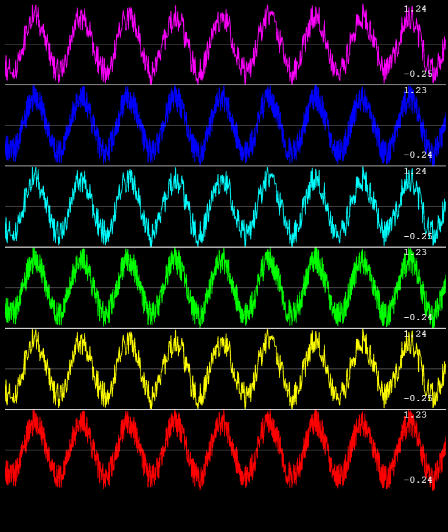

# webgl-plot-utils

A quality of life wrapper for webgl-plot library. For creating simple, stacked real time plots.
Incl thicc (triangle strip) lines, autoscaling for stacking, auto-interpolation or auto-slicing, text overlay support, 




```ts
type WebglLineProps = {
    values?:number[],
    color?:[number,number,number,number]|ColorRGBA,  
    position?:number, //stack position? default is the order you define the lines in this object or you can have them overlap
    autoscale?:boolean, //autoscale the data to -1 and 1 and stack, default true so you can just pass whatever
    centerZero?:boolean, //center the line at zero (if autoscaling), i.e. the positive and negative axis get the same amount of space, default false
    xAxis:boolean, //draw an xaxis, default true
    xColor?:[number,number,number,number]|ColorRGBA, //default gray and transparent
    width?:number, //use thick triangle strip lines instead, 6x slower!!
    interpolate?:boolean, //we can up or downsample data provided to update arrays, else we will use the end of the array for the slice (assuming you're pushing to an array and visualizing the incoming data)
    [key:string]:any
} & (
    { //define a fixed number of points
        nPoints:number
    }|{ //or define by number of seconds + samplerate
        nSec:number, 
        sps:number
    })

type WebglLinePlotProps = {
    canvas:HTMLCanvasElement,
    webglOptions?:{
        antialias?:boolean,
        transparent?:boolean,
        desynchronized?:boolean,
        powerPerformance?:'default'|'high-performance'|'low-power',
        preserveDrawing?:boolean,
        debug?:boolean
    },
    overlay?:HTMLCanvasElement|boolean, //automatically print the max and min values of the stacked lines
    lines:{
        [key:string]:WebglLineProps
    },
    interpolate?:boolean, //we can up or downsample data provided to update arrays, else we will use the end of the array for the slice (assuming you're pushing to an array and visualizing the incoming data)
    dividerColor?:[number,number,number,number]|ColorRGBA, //default gray
    [key:string]:any
}

import {WebglLinePlotUtil} from 'webgl=plot-utils'

let plotter = new WebglLinePlotUtil()

let canvas = document.createElement('canvas')
canvas.width = window.innerWidth;
canvas.height = window.innerHeight;
canvas.style.width = window.innerWidth;
canvas.style.height = window.innerHeight;

document.appendChild(canvas);

let settings = {
    canvas,
    overlay:true,
    lines:{
        'a': {
            values:new Array(10000).fill(Date.now()).map((v,i) => Math.sine(i*0.001+v)),
            color:[0,255,0,1]
        },
        'b': {
            values:new Array(10000).fill(Date.now()+2).map((v,i) => Math.cos(i*0.001+v)),
            color:[255,0,0,1]
        },
        'c': {
            values:new Array(10000).fill(Date.now()+3).map((v,i) => Math.cos(i*0.001)*Math.sine(i*0.001+v)),
            color:[0,0,255,1]
        }
    };
}

let plot = plotter.initPlot(settings);

let anim = () => {
    let lines = {
        'a': {
            values:new Array(10000).fill(Date.now()).map((v,i) => Math.sine(i*0.001+v))
        },
        'b': {
            values:new Array(10000).fill(Date.now()+2).map((v,i) => Math.cos(i*0.001+v))
        },
        'c': {
            values:new Array(10000).fill(Date.now()+3).map((v,i) => Math.cos(i*0.001)*Math.sine(i*0.001+v))
        }
    };

    plotter.update(plot,lines);

    requestAnimationFrame(anim);
}

anim();
```